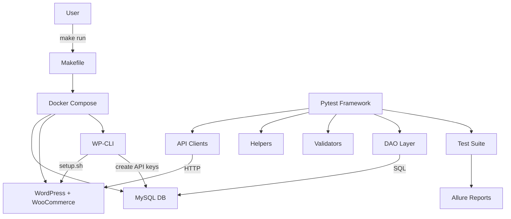

# 🧪 TestEcommerceAPI

A fully automated **API testing framework for WooCommerce**, built with Python, pytest, and Docker.

This project demonstrates **real-world API testing**, including:

* 🔌 REST API validation
* 🗄️ Database verification (DB + API consistency)
* 🐳 Fully reproducible Docker environment
* ⚙️ One-command setup (`make run`)
* 🔁 Idempotent infrastructure (safe to rerun)

---

# 🚀 Quick Start (One Command)

```bash
git clone https://github.com/Kwakic/TestingWoocommerceAPI.git
cd TestingWoocommerceAPI
make run
```

👉 That’s it. No manual setup required.

---

# 🧠 What Happens Behind the Scenes

Running:

```bash
make run
```

automatically performs:

1. 🐳 Starts Docker containers:

   * MySQL (database)
   * WordPress
   * WP-CLI

2. ⚙️ Bootstraps environment:

   * Installs WordPress
   * Installs WooCommerce
   * Generates API credentials
   * Auto-generates `.env`

3. 🧪 Executes test suite:

   * pytest runs API + DB validation tests

4. 📦 Installs the testing framework (editable mode)

   * Runs:

     ```bash
     pip install -e "./EcommerceAPI[dev]"
     ```

   * This makes the framework importable as a proper Python package
   * Ensures consistency between local runs and CI pipelines
---

# 🏗️ Architecture Overview



---

# 🧩 How to Understand This (Simple Explanation)

Think in 3 layers:

```
1. Infrastructure (Docker)
   → creates the system (WordPress + DB)

2. Framework (Python)
   → interacts with API + database

3. Tests (pytest)
   → validate behavior and data consistency
```

---

# 📂 Project Structure

```
EcommerceAPI/
  ├── api/
  ├── helpers/
  ├── validators/
  ├── dao/
  └── utils/

tests/
  ├── customers/
  └── shared/

scripts/
  └── setup.sh

docker-compose.wp.yml
Makefile
```

---

# 🔐 Authentication

* Uses **OAuth1 (WooCommerce API keys)**
* Credentials are automatically generated during setup
* `.env` file is created dynamically

---

# 🔁 Idempotent Setup

You can safely run:

```bash
make run
```

multiple times.

The system will:

* skip already installed components
* avoid duplicate data
* reuse existing DB

---

# 🧪 Running Tests Manually

If you want to run tests without `make run`:


```bash
pip install -e "./EcommerceAPI[dev]"
pytest -v
```

Don’t silently rely on:

```text
Python sys.path hack (running from root)
```

### ⚠️ One thing you should NOT do

### 🔹 CI-style test run (Allure-ready)

```bash
make test-ci
```

* Cleans previous Allure results
* Generates fresh test artifacts
* Matches CI pipeline behavior
---


# 📊 Test Coverage

The framework includes:

* ✅ Positive API tests
* ❌ Negative validation tests
* 🔄 Update & lifecycle tests
* 🗄️ Database consistency validation
* ⏱ Timestamp validation (API vs DB)

---

# 🐳 Requirements

* Docker
* Docker Compose
* Python 3.13+
* Make (or Git Bash on Windows)

---

# 💡 Why This Project Matters

It demonstrates:

* real API + DB integration testing
* clean test architecture
* reproducible environments
* CI-ready infrastructure
* enterprise-style framework design

---

# 🧪 Example Test Flow

1. Create customer via API
2. Fetch from database
3. Update via API
4. Validate:

   * API response
   * DB consistency
   * timestamps alignment

---

# 🏁 Output Example

```
✅ WordPress already installed — skipping
✅ WooCommerce already installed — skipping
API keys already exist — skipping
🎉 Setup complete!

================ test session starts ================
```

---

# 🛠️ Future Improvements

* GitHub Actions CI pipeline
* Allure report publishing
* Multi-environment support
* Performance testing extensions

---

# 👤 Author

Martin Svach

QA Engineer / Test Automation Engineer

---

# 📜 License

MIT License
