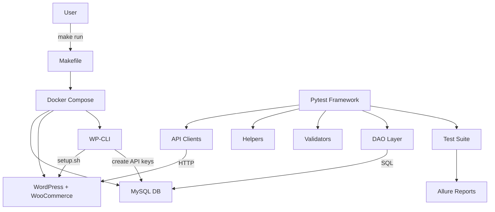

[](https://github.com/Kwakic/TestingWoocommerceAPI/actions/workflows/smoke.yml)

[](https://github.com/Kwakic/TestingWoocommerceAPI/actions/workflows/regression.yml)

[](https://github.com/Kwakic/TestingWoocommerceAPI/actions/workflows/performance.yml)

[](https://github.com/Kwakic/TestingWoocommerceAPI/actions/workflows/contract.yml)

[](https://github.com/Kwakic/TestingWoocommerceAPI/actions/workflows/security.yml)

[](https://github.com/Kwakic/TestingWoocommerceAPI/actions/workflows/preflight.yml)


---

## 📊 Live HTML Allure Dashboards

| Dashboard | URL |
|---|---|
| 🔥 Smoke Report | https://kwakic.github.io/TestingWoocommerceAPI |
| 🔬 Regression Report | https://kwakic.github.io/TestingWoocommerceAPI/regression |
| ⏱️ Performance Report | https://kwakic.github.io/TestingWoocommerceAPI/performance |

> **Contract**, **Security**, and **Preflight** workflows generate private CI artifacts only (not public dashboards).

---

# 🧪 TestEcommerceAPI

A fully automated **API testing framework for WooCommerce**, built with Python, pytest, and Docker.

This project demonstrates **real-world API testing**, including:

* 🔌 REST API validation
* 🗄️ Database verification (DB + API consistency)
* 🐳 Fully reproducible Docker environment
* ⚙️ One-command setup (`make run`)
* 🔁 Idempotent infrastructure (safe to rerun)

---

# 🚀 Quick Start (One Command)

```bash
git clone https://github.com/Kwakic/TestingWoocommerceAPI.git
cd TestingWoocommerceAPI
make run
```

👉 That’s it. No manual setup required.

---
## 🔄 CI/CD Workflow Architecture

Your project is evolving toward **segmented pipelines**. Currently:

### Current State (Monolithic)
- ✅ Single `ci.yml` runs preflight + smoke + contract
- ⚠️ All results in one Allure report

### Recommended Evolution (Segmented)

| Workflow | Trigger | Runtime | Allure | Purpose |
|----------|---------|---------|--------|---------|
| **preflight.yml** | PR | 1–3 min | ❌ | Framework health check |
| **smoke.yml** | push | 3–10 min | ✅ | Business flow validation |
| **regression.yml** | nightly | long | ✅ | Full coverage + trends |
| **performance.yml** | nightly | long | ✅ | Latency tracking |
| **security.yml** | nightly | medium | ⚠️ | Auth/permission validation |

👉 See [CI/CD Architecture Guide](./docs/README_CI_ALLURE_GUIDE.md) for detailed rationale.

---

## 📊 CI/CD & Reporting

The project uses:
- **GitHub Actions** for automated testing
- **Allure Reports** for test dashboards
- **GitHub Pages** for report hosting

View live Allure reports: [kwakic.github.io/TestingWoocommerceAPI](https://kwakic.github.io/TestingWoocommerceAPI)

### Workflows

| Workflow | Purpose | Trigger |
|----------|---------|---------|
| `ci.yml` | Run full test suite + generate Allure | Push to main |


📚 **Deep Dive:** See [CI/CD & Allure Reporting Guide](./docs/README_CI_ALLURE_GUIDE.md)
for enterprise architecture decisions, workflow configuration, and troubleshooting.
---

# 🧠 What Happens Behind the Scenes

Running:

```bash
make run
```

automatically performs:

1. 🐳 Starts Docker containers:

   * MySQL (database)
   * WordPress
   * WP-CLI

2. ⚙️ Bootstraps environment:

   * Installs WordPress
   * Installs WooCommerce
   * Generates API credentials
   * Auto-generates `.env`

3. 🧪 Executes test suite:

   * pytest runs API + DB validation tests

4. 📦 Installs the testing framework (editable mode)

   * Runs:

     ```bash
     pip install -e "./EcommerceAPI[dev]"
     ```

   * This makes the framework importable as a proper Python package
   * Ensures consistency between local runs and CI pipelines
---

# 🏗️ Architecture Overview



---

# 🧩 How to Understand This (Simple Explanation)

Think in 3 layers:

```
1. Infrastructure (Docker)
   → creates the system (WordPress + DB)

2. Framework (Python)
   → interacts with API + database

3. Tests (pytest)
   → validate behavior and data consistency
```

---

# 📂 Project Structure

```
EcommerceAPI/
  ├── api/
  ├── helpers/
  ├── validators/
  ├── dao/
  └── utils/

tests/
  ├── customers/
  └── shared/

scripts/
  └── setup.sh

docker-compose.wp.yml
Makefile
```

---

# 🔐 Authentication

* Uses **OAuth1 (WooCommerce API keys)**
* Credentials are automatically generated during setup
* `.env` file is created dynamically

---

# 🔁 Idempotent Setup

You can safely run:

```bash
make run
```

multiple times.

The system will:

* skip already installed components
* avoid duplicate data
* reuse existing DB

---

# 🧪 Running Tests Manually

If you want to run tests without `make run`:


```bash
pip install -e "./EcommerceAPI[dev]"
pytest -v
```

Don’t silently rely on:

```text
Python sys.path hack (running from root)
```

### ⚠️ One thing you should NOT do

### 🔹 CI-style test run (Allure-ready)

```bash
make test-ci
```

* Cleans previous Allure results
* Generates fresh test artifacts
* Matches CI pipeline behavior
---


# 📊 Test Coverage

The framework includes:

* ✅ Positive API tests
* ❌ Negative validation tests
* 🔄 Update & lifecycle tests
* 🗄️ Database consistency validation
* ⏱ Timestamp validation (API vs DB)

---

# 🐳 Requirements

* Docker
* Docker Compose
* Python 3.13+
* Make (or Git Bash on Windows)

---

# 💡 Why This Project Matters

It demonstrates:

* real API + DB integration testing
* clean test architecture
* reproducible environments
* CI-ready infrastructure
* enterprise-style framework design

---

# 🧪 Example Test Flow

1. Create customer via API
2. Fetch from database
3. Update via API
4. Validate:

   * API response
   * DB consistency
   * timestamps alignment

---

# 🏁 Output Example

```
✅ WordPress already installed — skipping
✅ WooCommerce already installed — skipping
API keys already exist — skipping
🎉 Setup complete!

================ test session starts ================
```

---

## 🗂️ Test Suite Organization

- **Microservice-aligned:** Each service (customers, orders, etc.) has its own test folder
- [Customers Test Suite](./tests/customers/README.md) — detailed architecture & checklist

---

# ✅ Current Capabilities
- ✔️ GitHub Actions CI pipeline (see ci.yml)
- ✔️ Allure report publishing (https://kwakic.github.io/TestingWoocommerceAPI)
- ✔️ Docker-based test execution
- ✔️ API + Database validation

---

# 🛠️ Future Enhancements
- Multi-environment support (staging/prod)
- Performance baselines & trend analysis
- Load testing extensions

---
## 🔗 Quick Links

| Resource | Link |
|----------|------|
| 📋 Allure Reports | [Live Dashboard](https://kwakic.github.io/TestingWoocommerceAPI) |
| 🔧 CI Workflows | [GitHub Actions](https://github.com/Kwakic/TestingWoocommerceAPI/actions) |
| 📖 API Docs | [Customers Tests](./tests/customers/README.md) |
| ⚙️ Config Guide | [Environment Setup](./docs/ENVIRONMENT_CONFIG_GUIDE.md) |
| 🚀 CI Architecture | [Enterprise Decisions](./docs/README_CI_ALLURE_GUIDE.md) |

---

## 👤 Author

**Martin Svach** — QA/Test Automation Engineer
GitHub: [@Kwakic](https://github.com/Kwakic)

Questions? Open an [issue](https://github.com/Kwakic/TestingWoocommerceAPI/issues)

---

# 📜 License

MIT License
