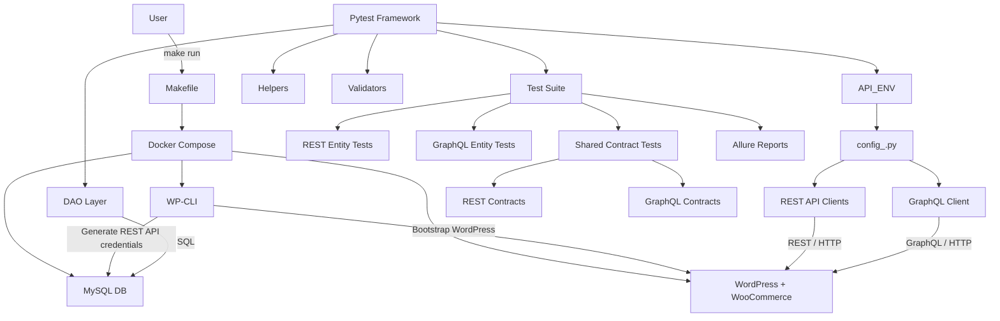

[](https://github.com/Kwakic/TestingWoocommerceAPI/actions/workflows/smoke.yml)

[](https://github.com/Kwakic/TestingWoocommerceAPI/actions/workflows/regression.yml)

[](https://github.com/Kwakic/TestingWoocommerceAPI/actions/workflows/integration.yml)

[](https://github.com/Kwakic/TestingWoocommerceAPI/actions/workflows/performance.yml)

[](https://github.com/Kwakic/TestingWoocommerceAPI/actions/workflows/contract.yml)

[](https://github.com/Kwakic/TestingWoocommerceAPI/actions/workflows/security.yml)

[](https://github.com/Kwakic/TestingWoocommerceAPI/actions/workflows/preflight.yml)


---

# 🧪 TestEcommerceAPI

A fully automated **API and UI testing framework for WooCommerce**, built with **Python**, **pytest**, **Playwright**, and **Docker**, supporting **REST, GraphQL, and browser-based UI testing**.

This project demonstrates real-world API and UI testing practices:

* 🔌 REST API validation
* 🔗 GraphQL API validation (WPGraphQL / WooGraphQL)
* 🎭 UI / browser automation with Playwright
* 🗄️ Database verification (API ↔ DB consistency)
* 🐳 Fully reproducible Docker environment
* ⚙️ One-command setup (`make run`)
* 🔁 Idempotent infrastructure (safe to rerun)

### 🧪 Test Automation Scope

The framework covers multiple layers of the WooCommerce application:

| Layer | Technology | Purpose |
|---|---|---|
| API | REST / WooCommerce API | Entity and lifecycle validation |
| API | GraphQL / WPGraphQL / WooGraphQL | Queries, mutations and schema validation |
| UI | Playwright | Browser-based end-to-end and UI workflow validation |
| Data | MySQL / DAO | API ↔ database consistency checks |

Playwright is integrated into the same pytest-based framework rather than
being maintained as a separate UI automation project.

---

## ✨ What makes this framework architecturally interesting

- 🏗️ **Domain-Driven Architecture** — Organizes the framework into independent business entities (Customers, Orders, Products, Coupons), each with its own REST/GraphQL API tests, UI tests where applicable, DAO, validators, models, helpers, and test data.

- 🐳 **Reproducible Test Environment** — Spins up a complete WordPress + WooCommerce stack using Docker, providing a deterministic environment for API and Playwright UI testing through a one-command bootstrap (`make run`).

- 🌍 **Environment-Aware Configuration** — Uses `API_ENV` together with entity configuration files to resolve endpoints dynamically, completely separating environment selection from authentication.

- 🧩 **Metadata-Driven Framework** — Automatically discovers entities, registers pytest plugins, generates CI matrices, and scales as new business domains are added with minimal configuration.

- 📝 **Structured Logging Architecture** — Implements a dual-layer logging system with developer-friendly console output and optional structured JSONL artifacts enriched with test context, correlation IDs, Git metadata, CI metadata, request details, and automatic payload redaction. :contentReference[oaicite:1]{index=1} :contentReference[oaicite:2]{index=2}

- 🔄 **Segmented CI/CD Pipelines** — Independent Smoke, Integration, Regression, Performance, Contract, Security, and Preflight workflows execute in isolation, publish dedicated artifacts, and scale independently.

- 📊 **Automated QA Reporting** — Generates interactive Allure reports and publishes a dynamic GitHub Pages QA Portal that automatically grows as new entity reports become available.

- 🎭 **Multi-Layer Test Automation** — Combines REST API, GraphQL API, database validation, and Playwright browser testing in a single pytest-based automation framework.

- 🔐 **Multi-Protocol Authentication** — Uses WooCommerce OAuth1 for REST API tests and WordPress Application Passwords over HTTP Basic Auth for authenticated GraphQL mutations, while keeping authentication independent from endpoint configuration.

---

## 🚀 Where to Start

New to the framework? Follow this path:

1. 📖 [Framework Overview](./docs/getting-started/README_FRAMEWORK_OVERVIEW.md)
2. 🧭 [Project Navigation Guide](./docs/project-structure/README_project_navigation.md)
3. 🧪 [Test Development Guide](./docs/development/README_TEST_DEVELOPMENT_GUIDE.md)

This will give you:
- what the framework does
- how it's structured
- how to write tests

---


## 🌐 QA Portal

The project publishes interactive Allure reports to GitHub Pages.

The **live QA Portal** is available at:

| Resource | URL |
|----------|-----|
| 🏠 QA Portal | https://kwakic.github.io/TestingWoocommerceAPI |

The portal is generated automatically during deployment from the reports that
are currently published to GitHub Pages.

As additional framework entities publish **Smoke**, **Integration**, **Regression** or
**Performance** reports, they automatically appear in the portal without requiring
any HTML or README updates.

> Contract, Security and Preflight intentionally publish CI artifacts only and are not displayed in the public QA Portal.

---

## 🎯 Who is this for?

* QA Engineers
* SDETs
* Python API automation developers
* UI automation engineers
* Teams building reusable test frameworks

---


## 📚 Documentation Hub

All in-depth guides live under [`docs/`](./docs). This README is the landing page — use the table below to jump straight to what you need.

| Category | Guide                                                                                   | Description                                              |
|---|-----------------------------------------------------------------------------------------|----------------------------------------------------------|
| **Getting Started** | [Framework Overview](./docs/getting-started/README_FRAMEWORK_OVERVIEW.md)               | High-level tour of the framework                         |
| | [QA Developer Onboarding](./docs/getting-started/README_QA_DEVELOPER_ONBOARDING.md)     | Onboarding steps for new contributors                    |
| | [Architecture Quick Start](./docs/getting-started/README_ARCHITECTURE_QUICK_START.md)   | Fast-track architecture primer                           |
| **Development** | [Test Development Guide](./docs/development/README_TEST_DEVELOPMENT_GUIDE.md) ⭐         | Canonical guide for writing tests                        |
| | [API Client Guide](./docs/development/README_API_CLIENT.md)                             | How the API client layer works                           |
| | [Architecture Guide](./docs/development/README_ARCHITECTURE.md)                         | Framework internals in depth                             |
| | [Validators Guide](./docs/development/README_VALIDATORS.md)                             | Writing and using validators                             |
| | [Team Guides](docs/development/team-guides)                                             | Per-entity guides (Customers, Orders, Coupons, Products) |
| | [GraphQL Testing Guide](./docs/development/README_GRAPHQL_TESTING_GUIDE.md) |GraphQL architecture, authentication, contracts and tests |
| **Framework** | [Plugins Reference](./docs/framework/README_PLUGINS_REFERENCE.md)                       | Pytest plugin architecture                               |
| | [Environment & Config Guide](./docs/framework/README_ENVIRONMENT_CONFIG_GUIDE.md)       | `API_ENV` and configuration resolution                   |
| | [Config Contract](./docs/framework/README_CONFIG_CONTRACT.md)                           | Configuration schema/contract                            |
| | [Authentication Guide](./docs/framework/README_AUTHENTICATION.md)                       | Credential handling                                      |
| | [Logging Architecture](./docs/framework/README_LOGGING_ARCHITECTURE.md)                 | Structured logging design                                |
| | [Entity Discovery Guide](./docs/framework/README_ENTITY_DISCOVER_ARCHITECTURE_GUIDE.md) | Metadata-driven entity discovery                         |
| **CI/CD** | [CI/CD Architecture Guide](./docs/ci/README_CI_ARCHITECTURE.md)                         | Workflow design & artifact strategy                      |
| | [Allure Reporting Guide](./docs/ci/README_ALLURE.md)                                    | Report generation & GitHub Pages publishing              |
| | [Environment & CI Guide](./docs/ci/README_ENV_AND_CI.md)                                | How environments map to pipelines                        |
| | [Docker Infrastructure Guide](./docs/ci/README_DOCKER_INFRASTRUCTURE.md)                | Container setup used in CI                               |
| | [Git Workflow Handbook](./docs/ci/README_GIT_WORKFLOW_HANDBOOK.md)                      | Branching & PR conventions                               |
| **Contributing** | [Contributing Guide](./docs/contributing/README_CONTRIBUTING.md)                        | How to contribute                                        |
| | [Changelog Guidelines](./docs/contributing/README_CHANGELOG_GUIDELINES.md)              | Changelog conventions                                    |
| | [Pyproject Guide](./docs/contributing/README_PYPROJECT.md)                              | Packaging & dependency notes                             |
| **Reference**  | [Full Project Structure](./docs/project-structure/README_project_navigation.md)         | Complete, unabridged directory tree |


---

## 📋 Prerequisites

Install the following tools before running the framework:

| Tool | Required | Notes |
|------|:--------:|-------|
| Python 3.13+ | ✅ | Required to run the framework |
| Docker Desktop | ✅ | Runs the WordPress, WooCommerce and MySQL containers |
| Git | ✅ | Clone the repository |
| GNU Make | ✅ | Required for the `make run` and other Makefile commands |
| Playwright browsers | ⚙️ | Installed automatically by `make run`; no manual browser installation required |

### Windows

Windows does not include GNU Make by default.

Install it using one of the following package managers:

```powershell
choco install make
```

or

```powershell
scoop install make
```

After installation, restart Git Bash or your terminal.

### Linux

```bash
sudo apt install make
```

### macOS

```bash
xcode-select --install
```

---

## 💡 Why This Project Matters

It demonstrates:

* REST API automation
* GraphQL API automation
* Playwright UI / browser automation
* API + DB integration testing
* Clean, domain-driven test architecture
* Reproducible environments
* CI-ready infrastructure
* Best-practice framework design


---

## 🚀 Quick Start (One-Command Setup)

Make sure **Docker Desktop** is running first.

Then clone the repository and bootstrap the complete test environment:

```bash
git clone https://github.com/Kwakic/TestingWoocommerceAPI.git && cd TestingWoocommerceAPI && make run
```

👉 **That's it — no manual Python or virtual-environment setup is required.**

### 💡 What `make run` does

On the first run, it automatically:

- 📁 Creates `.env` from `.env.example` when needed
- 🐍 Creates the project-local `.venv`
- 🔍 Verifies that `.venv` uses **Python 3.13+**
- 📦 Installs `EcommerceAPI[dev]` into `.venv`
- 🎭 Installs the Playwright browser binaries required by UI tests
- 🐳 Starts the Docker infrastructure
- 🌐 Installs WordPress
- 🛒 Installs WooCommerce
- 🔑 Generates WooCommerce REST API credentials
- ⚙️ Configures the local test environment
- 🌱 Seeds deterministic baseline WooCommerce data used by UI/E2E tests
- 🧪 Runs the test suite

### 🔁 Re-running `make run`

`make run` is idempotent. Subsequent runs:

- ♻️ Reuse the existing `.venv` when valid
- 🐳 Reuse the existing Docker environment
- ⏭️ Skip already-installed components where applicable
- 🚫 Avoid creating duplicate data
- 💾 Preserve the existing database
- 🔑 Generate new REST credentials only when a fresh WordPress installation is created
- 🧪 Run the tests again
- 🔄 Refreshes credentials when a fresh WordPress installation requires them

> **💡 You do not need to activate `.venv` manually.**
>
> `make run` invokes the project-local Python environment directly. Manual
> activation is only needed when running `python`, `pytest`, or other Python
> commands directly from your terminal.

After the bootstrap completes, normal test execution is simply:

```bash
make test
```

---

## 🌍 Environment Selection

Use the `API_ENV` variable to switch between environments (e.g. `test`, `staging`, `prod`).

Example:

```bash
API_ENV=test pytest
```

📌 The framework automatically resolves the correct API endpoint based on the selected environment.


📚 **Related documentation:** [GraphQL Testing Guide](./docs/development/README_GRAPHQL_TESTING_GUIDE.md)

---

## 🔄 CI/CD Overview

The framework uses a segmented CI/CD architecture with independent workflows:

- Smoke
- Integration
- Regression
- Performance
- Contract
- Security
- Preflight

Each workflow runs independently and publishes its own artifacts and reports.

GraphQL framework-level contract tests run through the **Contract** workflow. GraphQL does not require a separate CI workflow: connectivity and schema-contract checks live under `tests/shared/contracts/graphql/`.

📚 Learn more:
- [CI/CD Architecture Guide](./docs/ci/README_CI_ARCHITECTURE.md)
- [Allure Reporting Guide](./docs/ci/README_ALLURE.md)
---

## 🔄 CI/CD & Reporting

The framework uses segmented GitHub Actions workflows:

- Smoke
- Integration
- Regression
- Performance
- Contract
- Security
- Preflight

Reports are:
- generated with Allure
- published to GitHub Pages (QA Portal)

📚 Learn more:
- [CI/CD Architecture Guide](./docs/ci/README_CI_ARCHITECTURE.md)
- [Allure Reporting Guide](./docs/ci/README_ALLURE.md)
---


## 🏗️ Architecture Overview

The framework is organized into three main layers:

- **Infrastructure** → Dockerized WordPress + MySQL
- **Framework** → Python API clients, validators, and data access
- **Tests** → pytest-based validation and reporting


```mermaid
flowchart TD

    %% --------------------------------------------------
    %% Infrastructure
    %% --------------------------------------------------

    A[User] -->|make run| B[Makefile]
    B --> C[Docker Compose]

    C --> D[MySQL DB]
    C --> E[WordPress + WooCommerce]
    C --> F[WP-CLI]

    F -->|Bootstrap WordPress| E
    F -->|Generate REST API credentials| D

    %% --------------------------------------------------
    %% Framework
    %% --------------------------------------------------

    G[Pytest Framework] --> N[API_ENV]
    N --> O[config_<entity>.py]
    O --> H[REST API Clients]
    O --> Q[GraphQL Client]

    G --> I[Helpers]
    G --> J[Validators]
    G --> K[DAO Layer]

    H -->|REST / HTTP| E
    Q -->|GraphQL / HTTP| E
    K -->|SQL| D

    %% --------------------------------------------------
    %% Tests & Reporting
    %% --------------------------------------------------

    G --> L[Test Suite]
    L --> R[REST Entity Tests]
    L --> S[GraphQL Entity Tests]
    L --> T[Shared Contract Tests]
    T --> U[REST Contracts]
    T --> V[GraphQL Contracts]
    L --> M[Allure Reports]
```


📚 Deep dive:
- [Architecture Quick Start](./docs/getting-started/README_ARCHITECTURE_QUICK_START.md)
- [Architecture Guide](./docs/development/README_ARCHITECTURE.md)

---

## 🧭 Project Structure

This project follows a domain-driven architecture where each business entity
(customers, products, orders, coupons) owns its own REST API tests, GraphQL
tests, DAO, validators, models, helpers, and performance tests.

Framework-level protocol contracts are kept separately under
`tests/shared/contracts/`, with REST and GraphQL contract tests grouped by
protocol.

👉 For a full breakdown of the structure, responsibilities, and where to extend the framework:

📚 [Full Project Structure](./docs/project-structure/README_project_navigation.md)


---

## 🔐 Authentication

The framework uses different authentication mechanisms for the two API protocols:

* **REST API** → OAuth1 with WooCommerce API keys
* **GraphQL API** → HTTP Basic Auth using a WordPress Application Password
  (`WP_ADMIN_USER` / `WP_ADMIN_APP_PASSWORD`)
* REST and GraphQL authentication are intentionally kept independent

📚 **Related documentation:** [Authentication Guide](./docs/framework/README_AUTHENTICATION.md) · [GraphQL Guide](./docs/development/README_GRAPHQL.md)

---
## 🧪 Running Tests Manually

If you want to run tests without `make run`:


For normal development use:

```bash
make test
```

Manual pytest execution is primarily intended for framework development.
Playwright browsers are installed automatically as part of the project development
dependencies/bootstrap; developers do not need to run `playwright install` separately
when using `make run`.

```bash
python -m pip install -e "./EcommerceAPI[dev]"
python -m pytest -v
```

> ⚠️ **One thing you should NOT do:** rely on the Python `sys.path` hack of running from repo root without installing the package — install it in editable mode instead (see above).

**CI-style test run (Allure-ready):**

```bash
make test-ci
```

This cleans previous Allure results, generates fresh test artifacts, and matches CI pipeline behavior exactly.

---

## 📊 Test Coverage

The framework includes:

* ✅ Positive REST API tests
* 🔗 GraphQL queries and mutations
* ❌ Negative validation tests
* 🔄 Update & lifecycle tests
* 🗄️ Database consistency validation
* 📐 REST and GraphQL contract validation
* 🔐 Authentication and authorization scenarios
* ⏱️ Timestamp validation (API vs DB)

📚 **Related documentation:** [Test Development Guide](./docs/development/README_TEST_DEVELOPMENT_GUIDE.md) · [API Client Guide](./docs/development/README_API_CLIENT.md) · [Validators Guide](./docs/development/README_VALIDATORS.md)


---

## 🧪 Test Organization

Tests are organized by domain (customers, products, orders, coupons),
with REST API tests, GraphQL tests, Playwright UI tests where applicable,
and performance tests grouped inside each domain.

Framework-level tests live under `tests/shared/`, including:

* `contracts/rest/` — REST response and connectivity contracts
* `contracts/graphql/` — GraphQL connectivity and schema contracts
* `security/` — authentication and security validation
* `preflight/` — environment and framework checks

📚 See: [Test Development Guide](./docs/development/README_TEST_DEVELOPMENT_GUIDE.md)

---

## ✅ Current Capabilities

* ✔️ Segmented GitHub Actions CI/CD architecture
* ✔️ Automatically generated GitHub Pages QA Portal
* ✔️ Metadata-driven entity discovery
* ✔️ Independent Smoke, Integration, Regression, and Performance dashboards
* ✔️ REST API test coverage across business entities
* ✔️ GraphQL query and mutation test coverage
* ✔️ Playwright UI / browser test coverage
* ✔️ GraphQL schema/contract validation
* ✔️ Separate REST OAuth1 and GraphQL Application Password authentication
* ✔️ Allure history preservation
* ✔️ Automated report publication to GitHub Pages
* ✔️ Docker-based reproducible test execution
* ✔️ API + Database validation

---

## 🛠️ Future Enhancements

* Load testing extensions

---

## 🔗 Quick Links

| Resource | Link |
|---|---|
| 📋 QA Portal | [Live portal](https://kwakic.github.io/TestingWoocommerceAPI) |
| 🔧 CI Workflows | [GitHub Actions](https://github.com/Kwakic/TestingWoocommerceAPI/actions) |
| 📖 Test Suite Docs | [Tests README](tests/README.md) |
| ⚙️ Config Guide | [Environment & Config Guide](./docs/framework/README_ENVIRONMENT_CONFIG_GUIDE.md) |
| 🚀 CI Architecture | [CI/CD Architecture Guide](./docs/ci/README_CI_ARCHITECTURE.md) |
| 📊 Allure Guide | [Allure Reporting Guide](./docs/ci/README_ALLURE.md) |
| 🔗 GraphQL Guide | [GraphQL Guide](./docs/development/README_GRAPHQL.md) |

---

## 🔧 Troubleshooting

### `make: command not found`

GNU Make is not installed or your terminal needs to be restarted after installation.

See the **Prerequisites** section above.

---

### Docker reports `Virtualization support not detected`

Ensure hardware virtualization is enabled in your BIOS/UEFI.

Verify with:

```powershell
systeminfo
```

The output should include:

```text
Virtualization Enabled In Firmware: Yes
```

---

### `Conflict. The container name "/wc-db" is already in use`

Another WooCommerce test environment is already using the fixed Docker containers (`wc-db`, `wc-wp`, `wc-cli`).

If you no longer need that environment:

```bash
docker rm -f wc-db wc-wp wc-cli
make run
```

> The framework uses fixed container names, so only one local instance can run at a time.

---

### Git Bash rewrites Docker paths

Git Bash may automatically rewrite Unix paths passed to Docker.

The framework disables this behavior automatically using

```
MSYS_NO_PATHCONV=1
```

when invoking WP-CLI commands.

If you execute Docker Compose commands manually, remember to
set this variable as well.

---

## 👤 Author

**Martin Svach** — QA/Test Automation Engineer
GitHub: [@Kwakic](https://github.com/Kwakic)

Questions? Open an [issue](https://github.com/Kwakic/TestingWoocommerceAPI/issues).

---

## 📜 License

MIT License
