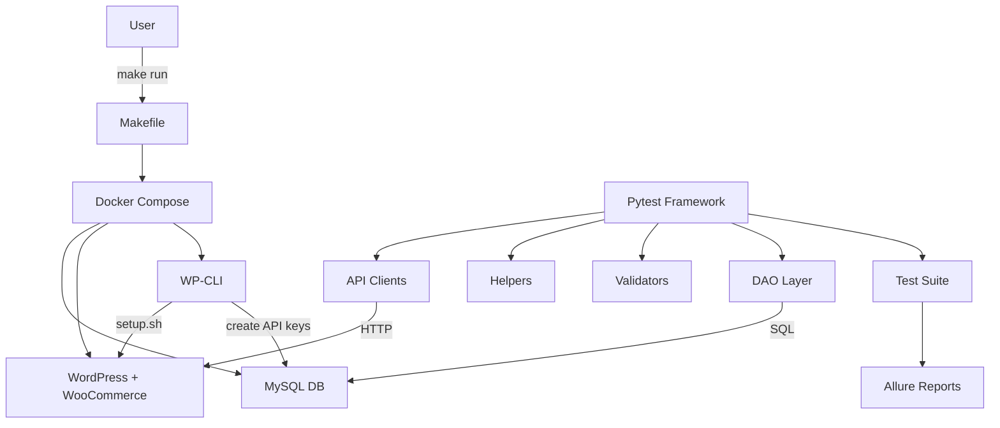

[](https://github.com/Kwakic/TestingWoocommerceAPI/actions/workflows/smoke.yml)

[](https://github.com/Kwakic/TestingWoocommerceAPI/actions/workflows/regression.yml)

[](https://github.com/Kwakic/TestingWoocommerceAPI/actions/workflows/integration.yml)

[](https://github.com/Kwakic/TestingWoocommerceAPI/actions/workflows/performance.yml)

[](https://github.com/Kwakic/TestingWoocommerceAPI/actions/workflows/contract.yml)

[](https://github.com/Kwakic/TestingWoocommerceAPI/actions/workflows/security.yml)

[](https://github.com/Kwakic/TestingWoocommerceAPI/actions/workflows/preflight.yml)


---

# 🧪 TestEcommerceAPI

A fully automated **API testing framework for WooCommerce**, built with **Python**, **pytest**, and **Docker**.

This project demonstrates real-world API testing practices:

* 🔌 REST API validation
* 🗄️ Database verification (API ↔ DB consistency)
* 🐳 Fully reproducible Docker environment
* ⚙️ One-command setup (`make run`)
* 🔁 Idempotent infrastructure (safe to rerun)

---

## ✨ What makes this framework architecturally interesting

- 🏗️ **Domain-Driven Architecture** — Organizes the framework into independent business entities (Customers, Orders, Products, Coupons), each with its own API layer, DAO, validators, models, helpers, and tests.
- 🐳 **Reproducible Test Environment** — Spins up a complete WordPress + WooCommerce stack using Docker, providing consistent local and CI execution with one-command setup.
- 🧩 **Metadata-Driven Framework** — Automatically discovers entities, registers pytest plugins, and scales as new domains are added with minimal configuration.
- 🔄 **Segmented CI/CD Pipelines** — Independent Smoke, Integration, Regression, Performance, Contract, Security, and Preflight workflows produce isolated artifacts and reports.
- 📊 **Automated QA Reporting** — Generates interactive Allure reports and publishes a dynamic GitHub Pages QA Portal that grows automatically as new entity reports become available.

---

## 🌐 QA Portal

The project publishes interactive Allure reports to GitHub Pages.

The **live QA Portal** is available at:

| Resource | URL |
|----------|-----|
| 🏠 QA Portal | https://kwakic.github.io/TestingWoocommerceAPI |

The portal is generated automatically during deployment from the reports that
are currently published to GitHub Pages.

As additional framework entities publish **Smoke**, **Integration**, **Regression** or
**Performance** reports, they automatically appear in the portal without requiring
any HTML or README updates.

> Contract, Security and Preflight intentionally publish CI artifacts only and are not displayed in the public QA Portal.

---

## 🎯 Who is this for?

* QA Engineers
* SDETs
* Python API automation developers
* Teams building reusable test frameworks

---


## 📚 Documentation Hub

All in-depth guides live under [`docs/`](./docs). This README is the landing page — use the table below to jump straight to what you need.

| Category | Guide                                                                                                    | Description |
|---|----------------------------------------------------------------------------------------------------------|---|
| **Getting Started** | [Framework Overview](./docs/getting-started/README_FRAMEWORK_OVERVIEW.md)                                | High-level tour of the framework |
| | [QA Developer Onboarding](./docs/getting-started/README_QA_DEVELOPER_ONBOARDING.md)                      | Onboarding steps for new contributors |
| | [Architecture Quick Start](./docs/getting-started/README_ARCHITECTURE_QUICK_START.md)                    | Fast-track architecture primer |
| **Development** | [Test Development Guide](./docs/development/README_TEST_DEVELOPMENT_GUIDE.md) ⭐                          | Canonical guide for writing tests |
| | [API Client Guide](./docs/development/README_API_CLIENT.md)                                              | How the API client layer works |
| | [Architecture Guide](./docs/development/README_ARCHITECTURE.md)                                          | Framework internals in depth |
| | [Validators Guide](./docs/development/README_VALIDATORS.md)                                              | Writing and using validators |
| | [Team Guides](docs/development/team-guides)                                                            | Per-entity guides (Customers, Orders, Coupons, Products) |
| **Framework** | [Plugins Reference](./docs/framework/README_PLUGINS_REFERENCE.md)                                        | Pytest plugin architecture |
| | [Environment & Config Guide](./docs/framework/README_ENVIRONMENT_CONFIG_GUIDE.md)                        | `API_ENV` and configuration resolution |
| | [Config Contract](./docs/framework/README_CONFIG_CONTRACT.md)                                            | Configuration schema/contract |
| | [Authentication Guide](./docs/framework/README_AUTHENTICATION.md)                                        | OAuth1 credential handling |
| | [Logging Architecture](./docs/framework/README_LOGGING_ARCHITECTURE.md)                                  | Structured logging design |
| | [Entity Discovery Guide](./docs/framework/README_ENTITY_DISCOVER_ARCHITECTURE_GUIDE.md)                  | Metadata-driven entity discovery |
| **CI/CD** | [CI/CD Architecture Guide](./docs/ci/README_CI_ARCHITECTURE.md)                                          | Workflow design & artifact strategy |
| | [Allure Reporting Guide](./docs/ci/README_ALLURE.md)                                                     | Report generation & GitHub Pages publishing |
| | [Environment & CI Guide](./docs/ci/README_ENV_AND_CI.md)                                                 | How environments map to pipelines |
| | [Docker Infrastructure Guide](./docs/ci/README_DOCKER_INFRASTRUCTURE.md)                                 | Container setup used in CI |
| | [Git Workflow Handbook](./docs/ci/README_GIT_WORKFLOW_HANDBOOK.md)                                       | Branching & PR conventions |
| **Contributing** | [Contributing Guide](./docs/contributing/README_CONTRIBUTING.md)                                         | How to contribute |
| | [Changelog Guidelines](./docs/contributing/README_CHANGELOG_GUIDELINES.md)                               | Changelog conventions |
| | [Pyproject Guide](./docs/contributing/README_PYPROJECT.md)                                               | Packaging & dependency notes |
| **Reference** | [Full Project Structure](./docs/project-structure/domain-driven-microservice-framework-architecture.txt) | Complete, unabridged directory tree |


---


## 📋 Prerequisites

Install the following tools before running the framework:

| Tool | Required | Notes |
|------|:--------:|-------|
| Python 3.13+ | ✅ | Required to run the framework |
| Docker Desktop | ✅ | Runs the WordPress, WooCommerce and MySQL containers |
| Git | ✅ | Clone the repository |
| GNU Make | ✅ | Required for the `make run` and other Makefile commands |

### Windows

Windows does not include GNU Make by default.

Install it using one of the following package managers:

```powershell
choco install make
```

or

```powershell
scoop install make
```

After installation, restart Git Bash or your terminal.

### Linux

```bash
sudo apt install make
```

### macOS

```bash
xcode-select --install
```
---

## 💡 Why This Project Matters

It demonstrates:

* Real API + DB integration testing
* Clean, domain-driven test architecture
* Reproducible environments
* CI-ready infrastructure
* Best-practice framework design


---

## 🚀  Quick Start (One-Command Setup)

Make sure you have **Docker Desktop** running on your computer first.

Then, copy and paste this entire block below as single command into your terminal and press Enter:

```bash
git clone https://github.com/Kwakic/TestingWoocommerceAPI.git && cd TestingWoocommerceAPI && make run
```

👉 That's it — no manual setup required.

### 💡 What this automatically does for you:
* Downloads the project files to your computer.
* Moves your terminal inside the project folder.
* Launches the test servers and runs the test suite automatically.

The default execution environment is `API_ENV=test`, which runs tests from the host machine against the Docker-based WordPress instance.

---


## 🌍 Selecting the Execution Environment

The framework supports multiple execution environments through the `API_ENV` variable, which the framework uses to automatically resolve the correct API endpoint from the entity configuration.

| Environment | Typical use |
|---|---|
| `test` | Local development (host → Docker WordPress) |
| `docker` | Tests running inside Docker |
| `ci` | GitHub Actions |
| `dev` | Shared development server |
| `staging` | Pre-production |
| `prod` | Production |

**Examples** (Linux/macOS and Git Bash):

```bash
# Local Docker environment (default)
API_ENV=test pytest

# Staging server
API_ENV=staging pytest

# Production
API_ENV=prod pytest
```

📌 The framework automatically resolves the correct API endpoint from the
entity configuration.


📚 **Related documentation:** [Environment & Config Guide](./docs/framework/README_ENVIRONMENT_CONFIG_GUIDE.md)

---

## 🔄 CI/CD Workflow Architecture

The project uses a **fully segmented CI/CD architecture** — each workflow has a dedicated responsibility, isolated runtime, its own artifacts, and an independent reporting strategy.

Rather than maintaining a static landing page, the deployment workflow discovers every published entity report and rebuilds the QA Portal on every GitHub Pages deployment, so the framework scales naturally as new entities are added.

| Workflow | Trigger | Runtime | Public Allure | Purpose |
|---|---|---|---|---|
| **preflight.yml** | PR + push | very fast | ❌ | Framework sanity & import validation |
| **contract.yml** | push/manual | fast | ❌ | API schema & response contract validation |
| **smoke.yml** | push | medium | ✅ | Critical business flow validation |
| **integration.yml** | push/manual | medium-long | ✅ | API + DB integration validation |
| **security.yml** | scheduled/manual | medium | ❌ | Authentication & authorization validation |
| **performance.yml** | scheduled/manual | long | ✅ | Latency & performance trend analysis |
| **regression.yml** | scheduled/manual | long | ✅ | Full regression coverage |

📚 **Related documentation:** [CI/CD Architecture Guide](./docs/ci/README_CI_ARCHITECTURE.md) · [Allure Reporting Guide](./docs/ci/README_ALLURE.md)

---

## 📊 CI/CD & Reporting

The reporting stack is built on:

* **GitHub Actions** — automated test execution
* **Allure Reports** — generated per workflow, aggregated into the QA Portal
* **GitHub Pages** — public report hosting

View the live portal: [kwakic.github.io/TestingWoocommerceAPI](https://kwakic.github.io/TestingWoocommerceAPI)

📚 **Related documentation:** [Allure Reporting Guide](./docs/ci/README_ALLURE.md) — history management, report generation, and GitHub Pages publishing.

---

## 🧠 What Happens Behind the Scenes

Running `make run` automatically performs:

1. **🐳 Starts Docker containers**
   * MySQL (database)
   * WordPress
   * WP-CLI

2. ⚙️ Bootstraps the environment

   • Installs WordPress
   • Installs WooCommerce
   • Generates WooCommerce API credentials

3. 🔐 Updates local configuration

   • Creates .env from .env.example (first run only)
   • Writes generated WooCommerce credentials
4.
   ```bash
   # From repo root (recommended)
   source .venv/Scripts/activate

   # Upgrade packaging tooling
   python -m pip install --upgrade pip setuptools wheel

   # Install framework + dev dependencies
   python -m pip install -e "./EcommerceAPI[dev]"
   ```

4. **🧪 Executes the test suite** — pytest runs the API + DB validation tests

---

## 🏗️ Architecture Overview


```mermaid
flowchart TD

    A[User] -->|make run| B[Makefile]
    B --> C[Docker Compose]

    C --> D[MySQL DB]
    C --> E[WordPress + WooCommerce]
    C --> F[WP-CLI]

    F -->|setup.sh| E
    F -->|create API keys| D

    G[Pytest Framework] --> H[API Clients]
    G --> I[Helpers]
    G --> J[Validators]
    G --> K[DAO Layer]

    H -->|HTTP| E
    K -->|SQL| D

    G --> L[Test Suite]
    L --> M[Allure Reports]
```

### 🧩 How to Understand This (Architecture at a Glance)

Think in 3 layers:

```
1. Infrastructure (Docker)
   → creates the system (WordPress + DB)

2. Framework (Python)
   → interacts with the API + database

3. Tests (pytest)
   → validate behavior and data consistency
```

📚 **Related documentation:** [Architecture Quick Start](./docs/getting-started/README_ARCHITECTURE_QUICK_START.md) · [Architecture Guide](./docs/development/README_ARCHITECTURE.md)

---

## 📂 Project Structure

This project follows an **entity domain-driven microservice architecture**: each business entity (customers, orders, coupons, products) owns its own DAO, API, validators, models, helpers, and tests.

```
TestEcommerceAPI/
├── .github/                     ← workflows, reusable actions, portal generator
├── docs/                        ← documentation hub (see above)
├── EcommerceAPI/                ← installable framework package
│   ├── plugins/                 ← pytest plugins & fixtures
│   └── src/
│       ├── metadata/ configs/ auth/ core/ clients/    ← shared framework layers
│       ├── customers/ orders/ coupons/ products/      ← per-entity: dao/ api/ validators/ models/ helpers/
│       ├── shared/               ← universal assertions, API helpers
│       └── utils/                ← universal reusable utilities
├── reports/                     ← allure-report/, allure-results/, logs/
├── tests/                       ← test suite root, one folder per entity team
│   ├── customers/ orders/ coupons/ products/   ← configs/, data/, api/, performance/
│   └── shared/                  ← contracts/, security/, preflight/
├── scripts/setup.sh
├── wp-data/
├── Makefile
├── docker-compose.matrix.yml
├── Dockerfile
├── conftest.py
├── pytest.ini
└── README.md                    ← you are here
```

📚 **Related documentation:** [Full Project Structure](./docs/project-structure/domain-driven-microservice-framework-architecture.txt) for the complete, unabridged tree.

---

## 🔐 Authentication

* Uses **OAuth1 (WooCommerce API keys)**
* Credentials are generated automatically during setup
* `.env` is created dynamically — no manual key management

📚 **Related documentation:** [Authentication Guide](./docs/framework/README_AUTHENTICATION.md)

---

## 🔁 Idempotent Setup

`make run` is idempotent. Re-running it in the same project will:

* reuse the existing Docker environment
* skip already-installed components
* avoid creating duplicate data
* preserve the existing database

---

## 🧪 Running Tests Manually

If you want to run tests without `make run`:

```bash
pip install -e "./EcommerceAPI[dev]"
pytest -v
```

> ⚠️ **One thing you should NOT do:** rely on the Python `sys.path` hack of running from repo root without installing the package — install it in editable mode instead (see above).

**CI-style test run (Allure-ready):**

```bash
make test-ci
```

This cleans previous Allure results, generates fresh test artifacts, and matches CI pipeline behavior exactly.

---

## 📊 Test Coverage

The framework includes:

* ✅ Positive API tests
* ❌ Negative validation tests
* 🔄 Update & lifecycle tests
* 🗄️ Database consistency validation
* ⏱️ Timestamp validation (API vs DB)

📚 **Related documentation:** [Test Development Guide](./docs/development/README_TEST_DEVELOPMENT_GUIDE.md) · [API Client Guide](./docs/development/README_API_CLIENT.md) · [Validators Guide](./docs/development/README_VALIDATORS.md)

---

## 🧪 Example Test Flow

1. Create a customer via API
2. Fetch the record from the database
3. Update it via API
4. Validate:
   * API response
   * DB consistency
   * Timestamp alignment

---

## 🏁 Output Example

```
✅ WordPress already installed — skipping
✅ WooCommerce already installed — skipping
API keys already exist — skipping
🎉 Setup complete!

================ test session starts ================
```

---

## 🗂️ Test Suite Organization

**Microservice-aligned:** each service (customers, orders, coupons, products) has its own test folder with a dedicated team guide.

* [Customers Test Suite](./docs/development/team-guides/README_CUSTOMERS.md) — detailed architecture & checklist
* [Orders Test Suite](./docs/development/team-guides/README_ORDERS.md) — detailed architecture & checklist
* [Coupons Test Suite](./docs/development/team-guides/README_COUPONS.md) — detailed architecture & checklist
* [Products Test Suite](./docs/development/team-guides/README_PRODUCTS.md) — detailed architecture & checklist

---

## ✅ Current Capabilities

* ✔️ Segmented GitHub Actions CI/CD architecture
* ✔️ Automatically generated GitHub Pages QA Portal
* ✔️ Metadata-driven entity discovery
* ✔️ Independent Smoke, Integration, Regression, and Performance dashboards
* ✔️ Allure history preservation
* ✔️ Automated report publication to GitHub Pages
* ✔️ Docker-based reproducible test execution
* ✔️ API + Database validation

---

## 🛠️ Future Enhancements

* Load testing extensions

---

## 🔗 Quick Links

| Resource | Link |
|---|---|
| 📋 QA Portal | [Live portal](https://kwakic.github.io/TestingWoocommerceAPI) |
| 🔧 CI Workflows | [GitHub Actions](https://github.com/Kwakic/TestingWoocommerceAPI/actions) |
| 📖 Test Suite Docs | [Tests README](tests/README.md) |
| ⚙️ Config Guide | [Environment & Config Guide](./docs/framework/README_ENVIRONMENT_CONFIG_GUIDE.md) |
| 🚀 CI Architecture | [CI/CD Architecture Guide](./docs/ci/README_CI_ARCHITECTURE.md) |
| 📊 Allure Guide | [Allure Reporting Guide](./docs/ci/README_ALLURE.md) |

---

## 🔧 Troubleshooting

### `make: command not found`

GNU Make is not installed or your terminal needs to be restarted after installation.

See the **Prerequisites** section above.

---

### Docker reports `Virtualization support not detected`

Ensure hardware virtualization is enabled in your BIOS/UEFI.

Verify with:

```powershell
systeminfo
```

The output should include:

```text
Virtualization Enabled In Firmware: Yes
```

---

### `Conflict. The container name "/wc-db" is already in use`

Another WooCommerce test environment is already using the fixed Docker containers (`wc-db`, `wc-wp`, `wc-cli`).

If you no longer need that environment:

```bash
docker rm -f wc-db wc-wp wc-cli
make run
```

> The framework uses fixed container names, so only one local instance can run at a time.


---

## 👤 Author

**Martin Svach** — QA/Test Automation Engineer
GitHub: [@Kwakic](https://github.com/Kwakic)

Questions? Open an [issue](https://github.com/Kwakic/TestingWoocommerceAPI/issues).

---

## 📜 License

MIT License
