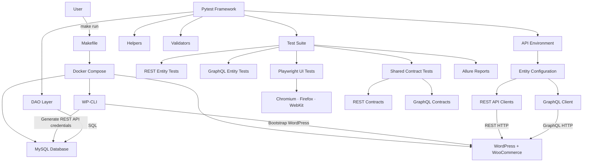

<div align="center">

# 🧪 TestEcommerceAPI

**Enterprise-style API and UI test automation framework for WooCommerce**

Python · pytest · Playwright · Docker · REST · GraphQL · MySQL · GitHub Actions · Allure

[](https://www.python.org/)
[](https://pytest.org/)
[](https://www.docker.com/)


[](https://github.com/Kwakic/TestingWoocommerceAPI/actions/workflows/smoke.yml)
[](https://github.com/Kwakic/TestingWoocommerceAPI/actions/workflows/ui.yml)
[](https://github.com/Kwakic/TestingWoocommerceAPI/actions/workflows/integration.yml)
[](https://github.com/Kwakic/TestingWoocommerceAPI/actions/workflows/regression.yml)
[](https://github.com/Kwakic/TestingWoocommerceAPI/actions/workflows/performance.yml)
[](https://github.com/Kwakic/TestingWoocommerceAPI/actions/workflows/contract.yml)
[](https://github.com/Kwakic/TestingWoocommerceAPI/actions/workflows/security.yml)
[](https://github.com/Kwakic/TestingWoocommerceAPI/actions/workflows/preflight.yml)

[🌐 QA Portal](https://kwakic.github.io/TestingWoocommerceAPI) · [🎭 UI Report](https://kwakic.github.io/TestingWoocommerceAPI/ui/) · [⚙️ GitHub Actions](https://github.com/Kwakic/TestingWoocommerceAPI/actions)

</div>

---

## 📋 Overview

TestEcommerceAPI is a **pytest-based quality engineering framework for WooCommerce** that brings API, UI, data, environment, reporting, and CI/CD concerns into one maintainable automation platform.

The framework supports:

- **🔌 REST API** testing through the WooCommerce API
- **🔗 GraphQL API** testing through WPGraphQL / WooGraphQL
- **🎭 UI/browser automation** with Playwright
- **🗄️ Database verification** through MySQL / DAO checks
- **🐳 Reproducible infrastructure** through Docker
- **📊 Automated reporting** with Allure and GitHub Pages
- **🔁 Segmented CI/CD** through independent GitHub Actions workflows
- **⚙️ One-command setup** (`make run`)

Playwright is intentionally integrated into the same pytest architecture rather than maintained as a separate UI automation project.

---

## 🏛️ Architecture at a Glance

The framework is designed around clear separation of responsibilities and business-domain ownership.

| Layer | Responsibility | Key technologies |
|---|---|---|
| **Infrastructure** | Reproducible application and database environment | Docker, Docker Compose, WordPress, WooCommerce, MySQL, WP-CLI |
| **Framework** | Clients, configuration, helpers, validators, plugins and data access | Python, pytest, Pydantic, DAO |
| **API** | REST and GraphQL communication and validation | WooCommerce API, WPGraphQL / WooGraphQL |
| **UI** | End-to-end browser workflows | Playwright, Chromium, Firefox, WebKit |
| **Tests** | Domain and framework-level quality validation | pytest |
| **Reporting** | Test evidence and public QA visibility | Allure, GitHub Pages |
| **CI/CD** | Independent execution and artifact management | GitHub Actions |

---

## ✨ Core architectural principles

- 🏗️ **Domain-Driven Architecture** — Organizes the framework into independent business entities (Customers, Orders, Products, Coupons), each with its own REST/GraphQL API tests, UI tests where applicable, DAO, validators, models, helpers, and test data.

- 🐳 **Reproducible Test Environment** — Spins up a complete WordPress + WooCommerce stack using Docker, providing a deterministic environment for API and Playwright UI testing through a one-command bootstrap (`make run`).

- 🌍 **Environment-Aware Configuration** — Uses `API_ENV` together with entity configuration files to resolve endpoints dynamically, completely separating environment selection from authentication.

- 🧩 **Metadata-Driven Framework** — Automatically discovers entities, registers pytest plugins, generates CI matrices, and scales as new business domains are added with minimal configuration.

- 📝 **Structured Logging Architecture** — Implements a dual-layer logging system with developer-friendly console output and optional structured JSONL artifacts enriched with test context, correlation IDs, Git metadata, CI metadata, request details, and automatic payload redaction. :contentReference[oaicite:1]{index=1} :contentReference[oaicite:2]{index=2}

- 🔄 **Segmented CI/CD Pipelines** — Independent Smoke, Integration, Regression, Performance, Contract, Security, and Preflight workflows execute in isolation, publish dedicated artifacts, and scale independently.

- 📊 **Automated QA Reporting** — Generates interactive Allure reports and publishes a dynamic GitHub Pages QA Portal that automatically grows as new entity reports become available.

- 🎭 **Multi-Layer Test Automation** — Combines REST API, GraphQL API, database validation, and Playwright browser testing in a single pytest-based automation framework.

- 🔐 **Multi-Protocol Authentication** — Uses WooCommerce OAuth1 for REST API tests and WordPress Application Passwords over HTTP Basic Auth for authenticated GraphQL mutations, while keeping authentication independent from endpoint configuration.

---

## 🎯 Quality Engineering Scope

The framework validates the application across multiple complementary layers rather than relying on a single test type.

| Quality layer | Coverage |
|---|---|
| **Functional API** | Positive, negative, CRUD, lifecycle, entity and business-flow validation |
| **GraphQL** | Queries, mutations, authentication, schema and connectivity contracts |
| **UI / E2E** | Browser workflows and cross-browser validation with Playwright |
| **Data consistency** | API ↔ database validation and timestamp checks |
| **Contract** | REST and GraphQL response/connectivity contracts |
| **Security** | Authentication and security-oriented validation |
| **Performance** | Response-time benchmarks with defined thresholds |

This structure makes the test strategy visible at a glance: **functional correctness, integration behavior, contracts, data consistency, security, browser workflows, and performance are treated as distinct quality concerns.**

---


## 🌐 Live QA Portal

The project publishes interactive Allure evidence to GitHub Pages.

**[Open the QA Portal →](https://kwakic.github.io/TestingWoocommerceAPI)**

API reports are organized by **entity and suite**, for example:

```text
/customers/smoke
/customers/integration
/products/smoke
```

The Playwright Allure report is published separately:

```text
/ui/
```

The UI report combines browser-specific results from the Chromium, Firefox, and WebKit CI matrix when the full browser policy applies.

The portal is **metadata-driven**: when additional entities publish supported operational suites such as Smoke, Integration, Regression, or Performance, the corresponding reports can appear without requiring manual HTML or README changes.

> Contract, Security, and Preflight intentionally remain artifact-oriented CI outputs and are not displayed in the public QA Portal.

---


## 🎯 Who is this for?

* QA Engineers
* SDETs
* Python API automation developers
* UI automation engineers
* Teams building reusable test frameworks

---


## 🚀 Where to Start

New to the framework? Follow this path:

1. 📖 [Framework Overview](./docs/getting-started/README_FRAMEWORK_OVERVIEW.md)
2. 🧭 [Project Navigation Guide](./docs/project-structure/README_project_navigation.md)
3. 🧪 [Test Development Guide](./docs/development/README_TEST_DEVELOPMENT_GUIDE.md)
4. 🎭 [UI Testing Guide](./docs/development/README_UI_TESTING_GUIDE.md)

This will give you:
- what the framework does
- how it's structured
- how to write API tests
- how to write and run Playwright UI tests

---


## 🏗️ System Architecture


```mermaid
flowchart TD

    A[User] -->|make run| B[Makefile]
    B --> C[Docker Compose]

    C --> D[MySQL Database]
    C --> E[WordPress + WooCommerce]
    C --> F[WP-CLI]

    F -->|Bootstrap WordPress| E
    F -->|Generate REST API credentials| D

    G[Pytest Framework] --> N[API Environment]
    N --> O[Entity Configuration]

    O --> H[REST API Clients]
    O --> Q[GraphQL Client]

    G --> I[Helpers]
    G --> J[Validators]
    G --> K[DAO Layer]

    H -->|REST HTTP| E
    Q -->|GraphQL HTTP| E
    K -->|SQL| D

    G --> L[Test Suite]

    L --> R[REST Entity Tests]
    L --> S[GraphQL Entity Tests]
    L --> W[Playwright UI Tests]
    W --> X[Chromium · Firefox · WebKit]

    L --> T[Shared Contract Tests]
    T --> U[REST Contracts]
    T --> V[GraphQL Contracts]

    L --> M[Allure Reports]
```

The architecture deliberately separates **infrastructure, framework services, domain tests, browser execution, contracts, and reporting** while keeping them connected through a single pytest-based execution model.

📚 [Architecture Quick Start](./docs/getting-started/README_ARCHITECTURE_QUICK_START.md) · [Architecture Guide](./docs/development/README_ARCHITECTURE.md)

---

## 🔄 CI/CD Strategy

The CI/CD architecture is segmented by **quality question**, allowing suites to run and evolve independently.

| Workflow | Primary purpose | Public QA Portal |
|---|---|:---:|
| **UI** | Playwright browser validation | ✅ `/ui/` |
| **Smoke** | Fast critical-path validation | ✅ |
| **Integration** | Cross-component behavior | ✅ |
| **Regression** | Broad functional validation | ✅ |
| **Performance** | Response-time benchmarking | ✅ |
| **Contract** | REST and GraphQL framework contracts | ❌ |
| **Security** | Authentication and security validation | ❌ |
| **Preflight** | Environment and framework readiness | ❌ |

Each workflow executes independently and publishes its own runtime artifacts. Public operational suites feed the QA Portal, while framework-oriented suites remain artifact-only.

GraphQL framework-level contract tests run through the **Contract** workflow under `tests/shared/contracts/graphql/`; a separate GraphQL CI workflow is not required.

---

📚 [CI/CD Architecture Guide](./docs/ci/README_CI_ARCHITECTURE.md) · [Allure Reporting Guide](./docs/ci/README_ALLURE.md) · [Environment & CI Guide](./docs/ci/README_ENV_AND_CI.md)

### 🎭 Browser execution policy

The UI workflow uses an explicit browser matrix:

| Execution | Browser coverage | Mode |
|---|---|---|
| Pull request | Chromium | Headless |
| Push to `main` | Chromium + Firefox + WebKit | Headless |
| Manual workflow | Chromium + Firefox + WebKit | Headless |
| Local debugging | Developer choice | Headed or headless |

This keeps pull-request feedback fast while providing broader cross-browser coverage after changes reach `main`.

📚 [UI Testing Guide](./docs/development/README_UI_TESTING_GUIDE.md)

---

## 🚀 Quick Start (One-Command Setup)

### 📋 Prerequisites

| Tool | Required | Notes |
|---|:---:|---|
| Python 3.13+ | ✅ | Required by the framework |
| Docker Desktop | ✅ | Runs WordPress, WooCommerce, and MySQL |
| Git | ✅ | Clone the repository |
| GNU Make | ✅ | Required by `make run` and other Makefile targets |
| Playwright browsers | ⚙️ | Installed automatically by the project bootstrap |

#### 🛠️ Installing GNU Make (Windows does not include `GNU Make` by default.)

| Platform | Installation |
|---|---|
| **Windows** | [Chocolatey](https://chocolatey.org/) → `choco install make` |
| **Windows** | [Scoop](https://scoop.sh/) → `scoop install make` |
| **Linux** | `sudo apt install make` |
| **macOS** | `xcode-select --install` |

> **Windows:** After installing GNU Make, restart Git Bash or your terminal.

---

## 🖥️ One-Command Setup
Make sure **Docker Desktop is running**, then:

```bash
git clone https://github.com/Kwakic/TestingWoocommerceAPI.git && cd TestingWoocommerceAPI && make run
```
---

### What `make run` provides

On the first run, the bootstrap process:

- 📁 Creates `.env` from `.env.example` when needed
- 🐍 Creates the project-local `.venv`
- 🔍 Verifies that `.venv` uses **Python 3.13+**
- 📦 Installs `EcommerceAPI[dev]` into `.venv`
- 🎭 Installs the Playwright browser binaries required by UI tests
- 🐳 Starts the Docker infrastructure
- 🌐 Installs WordPress
- 🛒 Installs WooCommerce
- 🔑 Generates WooCommerce REST API credentials
- ⚙️ Configures the local test environment
- 🌱 Seeds deterministic baseline WooCommerce data used by UI/E2E tests
- 🧪 Runs the test suite


### 🔁 Re-running `make run`

The command is designed to be **idempotent**. Subsequent runs reuse valid local state where possible, skip already-installed components, avoid duplicate data creation, preserve the database, and only generate new REST credentials when a fresh WordPress installation requires them.

> You do not need to activate `.venv` manually for `make run`. The Makefile invokes the project-local environment directly. Manual activation is only relevant when running Python, pytest, or other commands directly from your terminal.

After bootstrap, normal execution is:

```bash
make test
```

---

## 🌍 Environment Selection

Use `API_ENV` to select the target environment, for example:

```bash
API_ENV=test pytest
```

The framework resolves the appropriate API endpoint from the selected environment and entity configuration while keeping authentication concerns separate.

📚 [Environment & Config Guide](./docs/framework/README_ENVIRONMENT_CONFIG_GUIDE.md) · [Authentication Guide](./docs/framework/README_AUTHENTICATION.md)

---

## 🧪 Manual Test Execution

For normal development:

```bash
make test
```

For a CI-style, Allure-ready run:

```bash
make test-ci
```

For direct framework installation and pytest execution:

```bash
python -m pip install -e "./EcommerceAPI[dev]"
python -m pytest -v
```

Manual pytest execution is primarily intended for framework development. Playwright browsers are installed automatically as part of the project development/bootstrap flow.

> ⚠️ Install the framework in editable mode rather than relying on a `sys.path` workaround from the repository root.

---

## 📚 Documentation Hub

This README is the **landing page**. Detailed implementation and operational guidance lives under [`docs/`](./docs).

| Area | Guide | Purpose |
|---|---|---|
| **Getting Started** | [Framework Overview](./docs/getting-started/README_FRAMEWORK_OVERVIEW.md) | High-level framework tour |
| | [QA Developer Onboarding](./docs/getting-started/README_QA_DEVELOPER_ONBOARDING.md) | Contributor onboarding |
| | [Architecture Quick Start](./docs/getting-started/README_ARCHITECTURE_QUICK_START.md) | Fast architecture primer |
| **Development** | [Test Development Guide](./docs/development/README_TEST_DEVELOPMENT_GUIDE.md) ⭐ | Canonical guide for writing tests |
| | [API Client Guide](./docs/development/README_API_CLIENT.md) | API client design and usage |
| | [UI Testing Guide](./docs/development/README_UI_TESTING_GUIDE.md) | Playwright architecture, fixtures, Page Objects, roles, and browser execution |
| | [Architecture Guide](./docs/development/README_ARCHITECTURE.md) | Framework internals |
| | [Validators Guide](./docs/development/README_VALIDATORS.md) | Validation patterns |
| | [Team Guides](docs/development/team-guides) | Per-entity guides |
| | [GraphQL Testing Guide](./docs/development/README_GRAPHQL_TESTING_GUIDE.md) | GraphQL architecture, authentication, contracts, and tests |
| **Framework** | [Plugins Reference](./docs/framework/README_PLUGINS_REFERENCE.md) | Pytest plugin architecture |
| | [Environment & Config Guide](./docs/framework/README_ENVIRONMENT_CONFIG_GUIDE.md) | `API_ENV` and configuration resolution |
| | [Config Contract](./docs/framework/README_CONFIG_CONTRACT.md) | Configuration schema and contract |
| | [Authentication Guide](./docs/framework/README_AUTHENTICATION.md) | Credential handling |
| | [Logging Architecture](./docs/framework/README_LOGGING_ARCHITECTURE.md) | Structured logging design |
| | [Entity Discovery Guide](./docs/framework/README_ENTITY_DISCOVER_ARCHITECTURE_GUIDE.md) | Metadata-driven discovery |
| **CI/CD** | [CI/CD Architecture Guide](./docs/ci/README_CI_ARCHITECTURE.md) | Workflow design and artifact strategy |
| | [Allure Reporting Guide](./docs/ci/README_ALLURE.md) | Report generation and publication |
| | [Environment & CI Guide](./docs/ci/README_ENV_AND_CI.md) | Environment-to-pipeline mapping |
| | [Docker Infrastructure Guide](./docs/ci/README_DOCKER_INFRASTRUCTURE.md) | CI container setup |
| | [Git Workflow Handbook](./docs/ci/README_GIT_WORKFLOW_HANDBOOK.md) | Branching and PR conventions |
| **Contributing** | [Contributing Guide](./docs/contributing/README_CONTRIBUTING.md) | Contribution workflow |
| | [Changelog Guidelines](./docs/contributing/README_CHANGELOG_GUIDELINES.md) | Changelog conventions |
| | [Pyproject Guide](./docs/contributing/README_PYPROJECT.md) | Packaging and dependency notes |
| **Reference** | [Full Project Structure](./docs/project-structure/README_project_navigation.md) | Complete directory and extension guide |

### Suggested reading path

New to the framework? Start here:

1. [Framework Overview](./docs/getting-started/README_FRAMEWORK_OVERVIEW.md)
2. [Project Navigation Guide](./docs/project-structure/README_project_navigation.md)
3. [Test Development Guide](./docs/development/README_TEST_DEVELOPMENT_GUIDE.md)
4. [UI Testing Guide](./docs/development/README_UI_TESTING_GUIDE.md)

This path explains **what the framework does, how it is structured, and how to extend both API and UI automation**.

---

## 🗂️ Project Structure

The repository follows a domain-driven model in which business entities own the test assets that validate them.

```text
customers/
products/
orders/
coupons/
```

Within the broader test architecture, framework-level concerns remain under `tests/shared/`, including:

```text
tests/shared/contracts/rest/
tests/shared/contracts/graphql/
tests/shared/security/
tests/shared/preflight/
```

The intent is to keep **business-domain validation** separate from **framework- and protocol-level contracts**.

📚 [Full Project Structure](./docs/project-structure/README_project_navigation.md)

---

## 📊 Reporting Model

Allure is used as the primary test evidence format.

The reporting model distinguishes between:

- **Operational entity suites** — published to the public QA Portal
- **Playwright UI reporting** — published under `/ui/`
- **Framework-level suites** — Contract, Security, and Preflight remain CI artifacts

This separation keeps the public portal focused on operational quality evidence while retaining lower-level framework diagnostics inside CI artifacts.

📚 [Allure Reporting Guide](./docs/ci/README_ALLURE.md)

---

## 🔐 Authentication Model

| Protocol | Authentication |
|---|---|
| REST API | WooCommerce OAuth1 with API keys |
| GraphQL API | HTTP Basic Auth using WordPress Application Password |

REST and GraphQL authentication are intentionally independent from endpoint/environment configuration.

📚 [Authentication Guide](./docs/framework/README_AUTHENTICATION.md)

---


## 🔧 Troubleshooting

<details>
<summary><code>make: command not found</code></summary>

GNU Make is not installed or the terminal needs to be restarted after installation.

See the **Platform Notes** section above.

</details>

<details>
<summary>Docker reports <code>Virtualization support not detected</code></summary>

Ensure hardware virtualization is enabled in BIOS/UEFI.

Verify from PowerShell:

```powershell
systeminfo
```

The output should include:

```text
Virtualization Enabled In Firmware: Yes
```

</details>

<details>
<summary>Container name conflict: <code>/wc-db</code></summary>

Another WooCommerce test environment is already using the fixed containers (`wc-db`, `wc-wp`, `wc-cli`).

If that environment is no longer required:

```bash
docker rm -f wc-db wc-wp wc-cli
make run
```

Only one local instance can run at a time because the framework uses fixed container names.

</details>

<details>
<summary>Git Bash rewrites Docker paths</summary>

Git Bash can rewrite Unix-style paths passed to Docker. The framework disables this behavior for WP-CLI invocations with:

```text
MSYS_NO_PATHCONV=1
```

When invoking Docker Compose manually from Git Bash, apply the same environment setting where required.

</details>

---

## 🔗 Quick Links

| Resource | Link |
|---|---|
| 🌐 QA Portal | [Live portal](https://kwakic.github.io/TestingWoocommerceAPI) |
| 🎭 UI Allure Report | [Playwright report](https://kwakic.github.io/TestingWoocommerceAPI/ui/) |
| ⚙️ CI Workflows | [GitHub Actions](https://github.com/Kwakic/TestingWoocommerceAPI/actions) |
| 🧪 Test Suite Docs | [Tests README](tests/README.md) |
| 🔧 Config Guide | [Environment & Config Guide](./docs/framework/README_ENVIRONMENT_CONFIG_GUIDE.md) |
| 🚀 CI Architecture | [CI/CD Architecture Guide](./docs/ci/README_CI_ARCHITECTURE.md) |
| 📊 Allure Guide | [Allure Guide](./docs/ci/README_ALLURE.md) |
| 🔗 GraphQL Guide | [GraphQL Testing Guide](./docs/development/README_GRAPHQL_TESTING_GUIDE.md) |

---

## 🔭 Future Enhancements

- Load testing extensions

---

## 👤 Author

**Martin Svach** — QA/Test Automation Engineer
GitHub: [@Kwakic](https://github.com/Kwakic)

Questions or feedback? [Open an issue](https://github.com/Kwakic/TestingWoocommerceAPI/issues).

---

## 📜 License

MIT License
